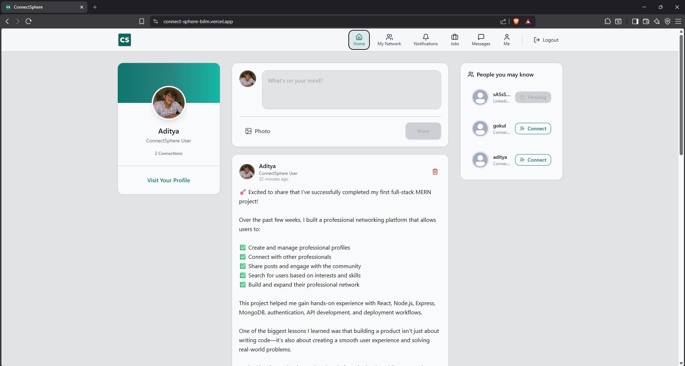
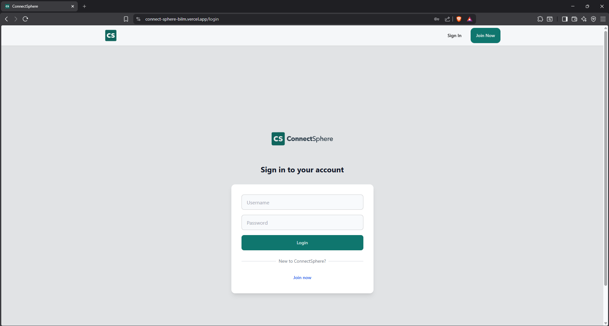
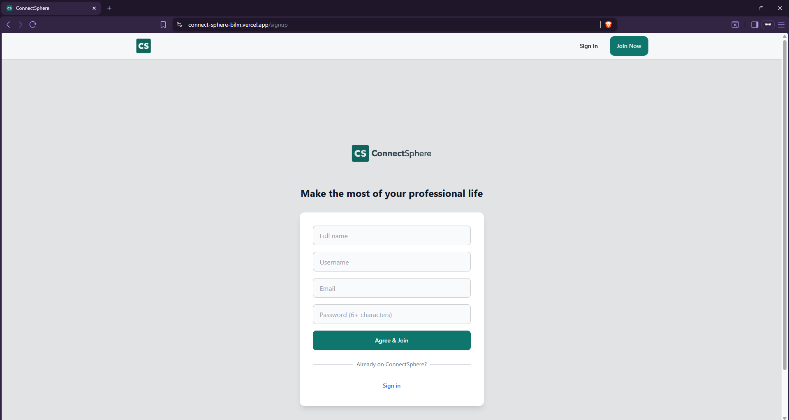
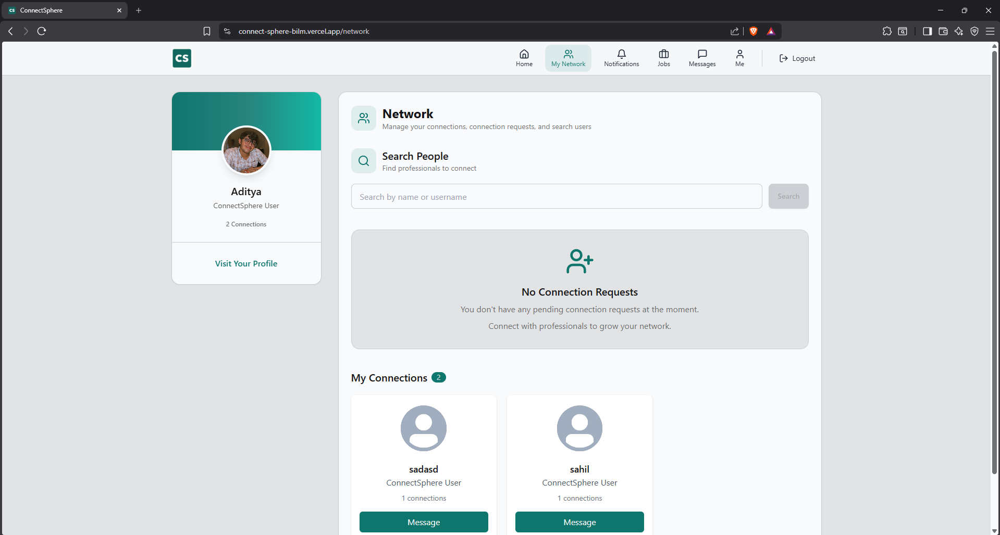
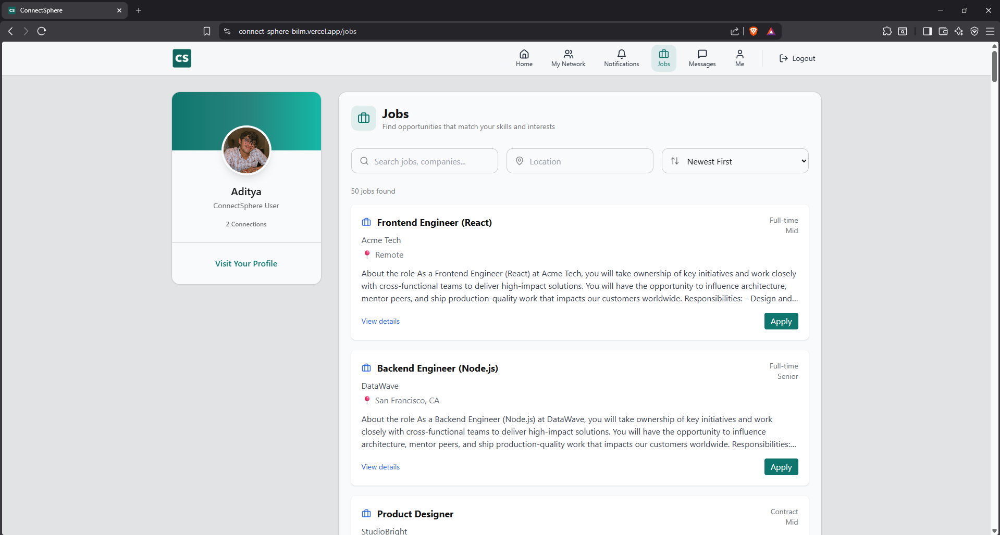
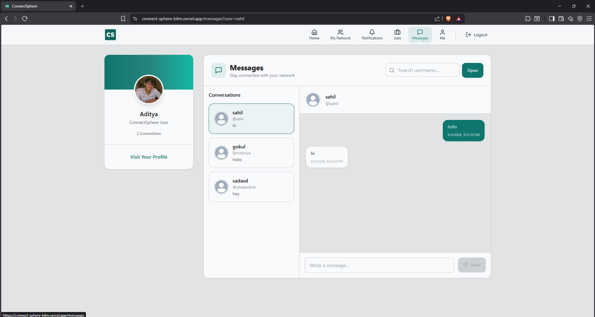
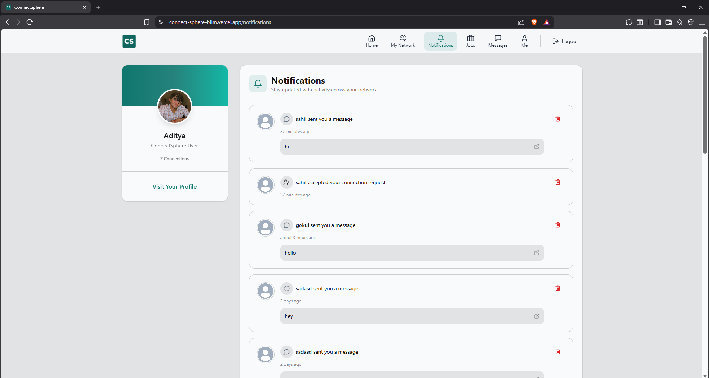
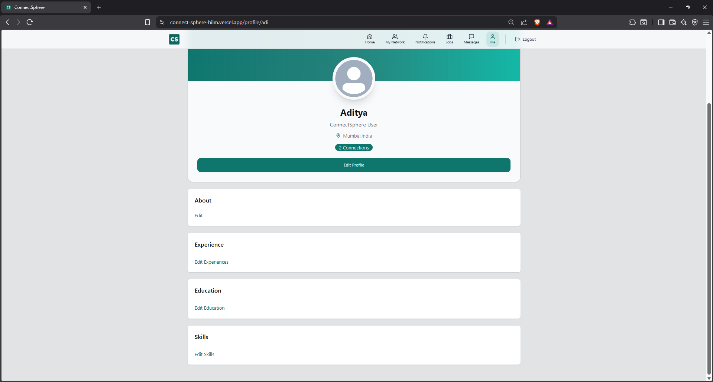

# ConnectSphere

A LinkedIn-inspired professional networking platform built using the MERN stack. Users can create profiles, connect with other professionals, share posts, and search for users to connect.

---

## Features

- **User Authentication (JWT)**
  - Sign up / Log in / Log out
  - Protected routes using JWT stored in an HTTP-only cookie

---

## Browser Compatibility Note

This application uses secure HTTP-only cookies for authentication.

The frontend is hosted on Vercel and the backend is hosted on Render. Since these are different domains, some browsers or privacy settings that block third-party cookies may prevent authentication from working correctly.

If login or signup succeeds but the user is not authenticated afterward:

- Allow third-party cookies for the site, or
- Use a browser that permits cross-site authentication cookies, or
- Deploy the frontend and backend under the same custom domain.

The application has been tested successfully with browsers that allow the authentication cookie to be stored and sent.

- **User Profile Management**
  - View profiles by username
  - Update personal details (profile page UI)

- **Profile & Banner Image Uploads**
  - Upload profile/banner images using **Cloudinary**

- **Create, Like and Comment on Posts**
  - Create posts (supports image upload)
  - Like posts
  - Comment on posts

- **Send and Accept Connection Requests**
  - Request connections
  - Accept/reject connection flows (network features)

- **Search Users**
  - Search for users by name or username
  - Browse results and send connection requests

- **Notifications System**
  - Like/comment/connection-related notifications
  - Mark notifications as read
  - Delete notifications

- **Responsive User Interface**
  - Tailwind CSS UI with responsive layout components

---

## Tech Stack

### Frontend

- **React**
- **React Router**
- **React Query (TanStack Query)** for server-state
- **Tailwind CSS** (with DaisyUI components)

### Backend

- **Node.js**
- **Express.js**

### Database

- **MongoDB** (Mongoose)

### Other Services

- **Cloudinary** for image uploads
- **JWT Authentication** (cookie-based)

---

## Project Structure

```text
client/
├── src/
├── components/
├── pages/

server/
├── controllers/
├── models/
├── routes/
├── middleware/
```

> In this repository, the folders are located at:
>
> - `frontend/` (React app)
> - `backend/` (Express API)

---

## Installation

### Backend

```bash
cd backend
npm install
npm run dev
```

### Frontend

```bash
cd frontend
npm install
npm run dev
```

---

## Environment Variables

> Create a `.env` file in **backend/**.

```env
PORT=
MONGO_URI=
JWT_SECRET=

CLOUDINARY_CLOUD_NAME=
CLOUDINARY_API_KEY=
CLOUDINARY_API_SECRET=
```

---

## Screenshots

### Overview







### Core Features











---

## API Summary (Base Path)

All backend endpoints are mounted under:

- `/api/v1`

---

## Challenges Faced

- **Implementing JWT authentication**
  - Ensuring protected routes work correctly with cookie-based JWT

- **Managing application state**
  - Coordinating authenticated data flows using React Query and protected routing

- **Integrating Cloudinary uploads**
  - Upload pipeline for profile/banner images (and post images where applicable)

- **Handling user relationships and connections**
  - Modeling connection requests and surfacing relationship updates via notifications

---

## Learnings

- MERN Stack Development
- REST API Design with Express
- Authentication & Authorization using JWT (cookie-based)
- MongoDB Data Modeling with Mongoose
- Cloudinary-based media uploads
- Building a responsive, component-driven UI

---

## Future Enhancements

- Real-time Chat
- Real-time Notifications
- Dark Mode

---

## Author

Aditya Kaswankar
Cloud Counselage GPI Internship Project
